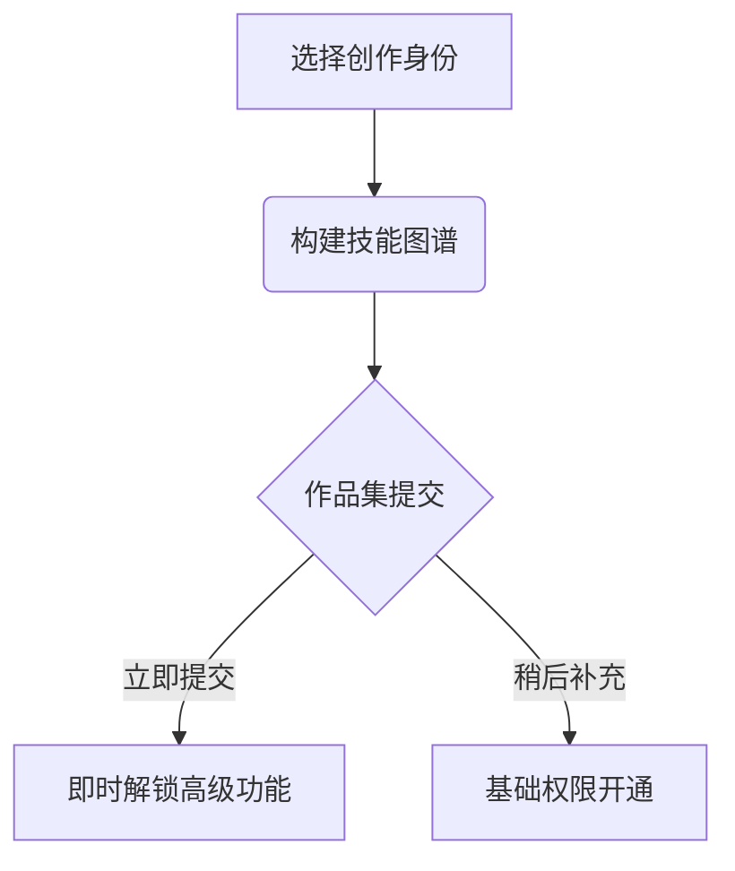
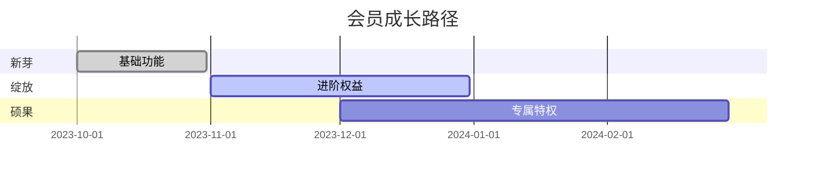
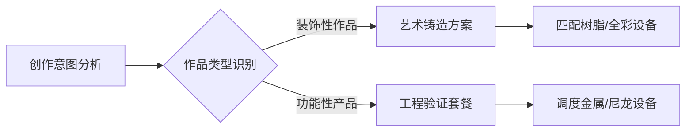

### **一、用户注册与信息收集系统**
#### 1. 极简注册流程（3步完成核心信息采集）


**1.1 身份识别层**
- **角色选择面板**（可视化图标引导）
  ```html
  <div class="role-card">
    <div class="card" data-role="designer">
      < img src="3d-modeling.svg" alt="设计师">
      <p>数字设计师</p >
    </div>
    <div class="card" data-role="artist">
      < img src="sculpture.svg" alt="艺术家">
      <p>艺术创作者</p >
    </div>
    <!-- 其他角色 -->
  </div>
  ```

**1.2 智能技能矩阵**
- **动态技能树**（根据所选角色加载）
  | 角色类型 | 技能维度 | 选项示例 |
  |----------|----------|----------|
  | 设计师 | 软件能力 | ▸ Blender精通<br>▸ ZBrush中级 |
  | 艺术家 | 创作媒介 | ▸ 金属雕塑<br>▸ 树脂艺术 |
  | 工程师 | 专业领域 | ▸ 机械结构设计<br>▸ 流体力学验证 |

**1.3 作品集轻量化提交**
- **无感收集方案**：
  - 第三方平台绑定（自动导入Behance/ArtStation作品）
  - 手机快速拍摄（AI自动提取3D可打印特征）
  - 延迟提交激励（"完善作品集立享3次免费打样"）

---

### **二、会员服务体系**
#### 2.1 成长型会员体系
**阶梯化权益模型**
| 等级 | 达成条件 | 核心权益 | 专属福利 |
|------|----------|----------|----------|
| **新芽** | 注册完成 | • 基础模型库<br>• 社区交流 | 首单9折 |
| **绽放** | 提交≥3作品 | • 专属设备通道<br>• 月度免费咨询 | 材料体验包 |
| **硕果** | 成功案例≥5 | • VIP生产排期<br>• 作品推广资源 | 年度精修服务 |

**权益可视化看板**


#### 2.2 智能专项服务
**需求-服务匹配引擎**


**场景化服务包**
- **艺术家尊享包**：
  ▸ 表面精处理（抛光/电镀）
  ▸ 限量编号证书
  ▸ 展览级包装
- **工程师加速包**：
  ▸ 加急生产通道
  ▸ 尺寸检测报告
  ▸ 批量复制优惠

#### 3.2 服务发现系统

**三维导航体系**：
- **按场景找服务**
  - "我有一个创意想法" → 概念转化指导 + 设计咨询
  - "我需要立即生产" → 快速报价入口 + 24小时加急通道
  - "我想改进现有模型" → 优化分析 + 迭代方案推荐

- **按材料选方案**
  - 树脂材料专区：透明/柔性/高强度树脂对比
  - 金属打印专场：铝合金/钛合金/不锈钢应用案例
  - 特种材料库：生物相容/高温耐受/食品级材料

- **按设备挑工艺**
  - 光固化精细处理：25μm精度，适合珠宝/牙科模型
  - 熔融沉积快速成型：低成本，适合概念验证
  - 选择性激光烧结：无支撑结构，复杂几何体成型

**智能推荐引擎**：基于历史订单和作品特征，自动匹配最优工艺路线

## Vercel Environment Variables

Set these environment variables in Vercel before deploying:

```bash
SITE_USER=admin
SITE_PASS=yourpassword
```
